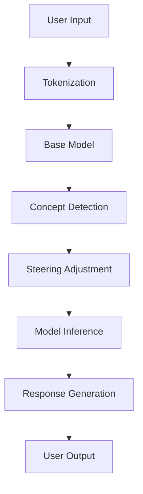

# System Architecture Overview

## Core Components

### 1. Model Layer
- **Base Model**: GPT-2 Small
- **Model Manager**: Handles model loading and inference
- **Tokenization**: Text processing and token management

### 2. Concept Detection
- **Probe System**: Linear probes for concept detection
- **Concept Registry**: Manages available concepts
- **Detection Pipeline**: Processes text through concept detectors

### 3. Steering System
- **Steering Controller**: Manages concept steering
- **State Management**: Tracks model state
- **User Controls**: Interface for adjusting steering

### 4. API Layer
- RESTful endpoints
- WebSocket for real-time updates
- Authentication & Rate Limiting

### 5. Frontend
- Web-based chat interface
- Concept visualization
- Control panel

## Data Flow

## Technology Stack

### Backend
- Python 3.9+
- FastAPI
- PyTorch
- Transformers

### Frontend
- React
- TypeScript
- Tailwind CSS

### Infrastructure
- Docker
- GitHub Actions
- Poetry (Dependency Management)
